# 代码审计


首先要说一下的是工具

编辑工具必不可少

有人喜欢notepad++，或者加了插件的Sublime Text 3，还有phpstorm，vscode

我编辑器上就喜欢vscode和加了插件的Sublime Text 3

那么就为难你听一下这两个了


代码审计工具有很多

Seay源代码审计系统，Fortify，rips等等


这里因为php是入门代码审计的最佳语言

所以就以php举例


先讲解一下

所谓的sql注入在php中体现

php中

通过几种方式获取参数

其中

$_GET['id']

这种就是用在url中如：http://www.xxxx.com/index.php?id=1


然后$_POST['id']

这种是用在协议包中以body方式传输

然后接下来就是下载cms，下载cms可以用**站长之家**这个网站来下载

也可以去GitHub下载，这里我讲sql注入使用的版本是zzcms8.2以下都ok


1、seay工具审查一次

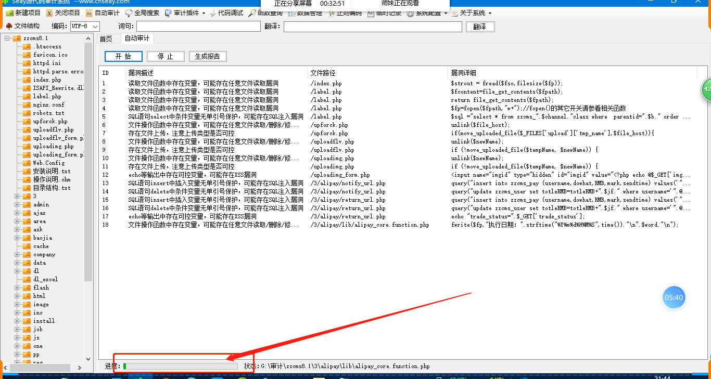

完成后追踪所有相关信息

其中

因为不是所有人都能把php都搞懂，

必须随时准备好谷歌百度php文档和函数的使用


## 2、用Sublime Text 3打开cms

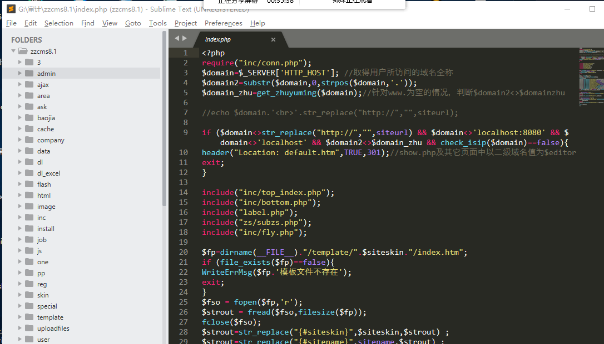


## 3、用phpstudy搭建这个cms

我记得这个cms要用低版本php去搭建，因此到时候要自己选好后进入安装

这里我已经安装好了

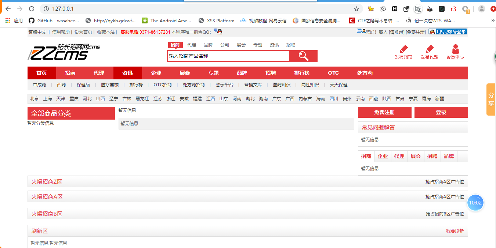

**注：这里建议用内网或者外网ip，别用127.0.0.1或者localhost，这样会抓不到包或者有一些乱七八糟的问题**


## 4、分析

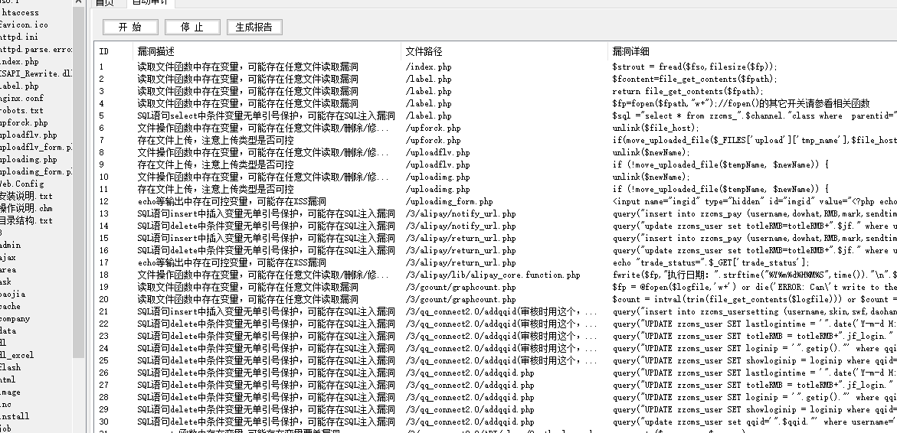

看到sql注入

点进去看看

找到可控参数，如$username 

那么它可不可以被注入呢？

分析

其通过post方法传进来的

$username=$_POST["username"];

然后传进了数据库，但是是不是没做过滤呢？

然后看到流程下来都没有做任何参数整改（**这里是我分析过的，这里待会自己去分析**）

然后发现

include("../../inc/top2.php");

这个包含文件，用编辑器跟一下看看，可以看到没做处理

但是这里进入了数据库

'$username','1','6.swf','$daohang')"

仅仅做插入，没办法进行select利用

最后被抛弃

但是既然都是username，就找select就好了：

因此找到这里（**中间是我分析过了所以我才跳过，如果是第一次分析的话，要尽量一个一个看和明白流程后才确定**）

$sql="select * from zzcms_user where lockuser=0 and username='". $username ."' and password='". md5($pwd)

然后这个php文件是不是也有include

```php
include("../../inc/conn.php");
include '../ucenter_api/config.inc.php';//集成ucenter
include '../ucenter_api/uc_client/client.php';//集成ucenter
```

后两个都是api，经验让我觉得它作用不大

然后就是看conn.php

这里看完php没危害后再看看include

```php
include(zzcmsroot."/inc/config.php");
include(zzcmsroot."/inc/wjt.php");
include(zzcmsroot."/inc/function.php");
include(zzcmsroot."/inc/zsclass.php");//分类招商在里面
include(zzcmsroot."/inc/stopsqlin.php");
include(zzcmsroot."/inc/area.php");
```

然后经验告诉我stopsqlin.php->stop+sql+inject->sql注入禁止

然后进入

addslashes(htmlspecialchars(trim($string)));

可以看到用了addslashes函数，这里建议百度以下，因为这个是

一个过滤函数，基本上使用这个函数就能过滤了sql和xss一个特殊符号注入

所以这里走回去看

```php
if($_REQUEST){
		if(get_magic_quotes_gpc()){
			$_POST =zc_check2($_POST);
			$_GET =zc_check2($_GET);
			$_COOKIE =zc_check2($_COOKIE);
			//@extract($_POST);
			//@extract($_GET);
		}else{
			$_POST = zc_check($_POST);
			$_GET = zc_check($_GET);
			$_COOKIE =zc_check($_COOKIE);
			//@extract($_POST);
			//@extract($_GET);
		}
}
```

这里就是说，把所有GET,POST,COOKIE 传过来的参数全部经过zc_check函数过滤

而zc_check使用了addslashes函数

所以说包含了stopsqlin.php和conn.php的基本没戏注入了，但是继续分析后我发现一个有趣的点

loginip = '".getip()

这里有个ip

获取的ip

我就看到了函数getip()

追踪函数：

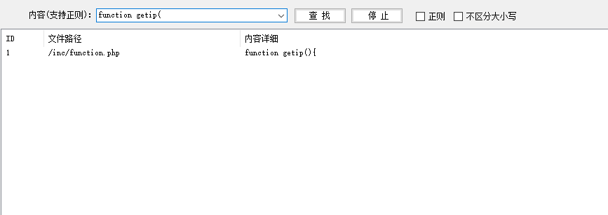

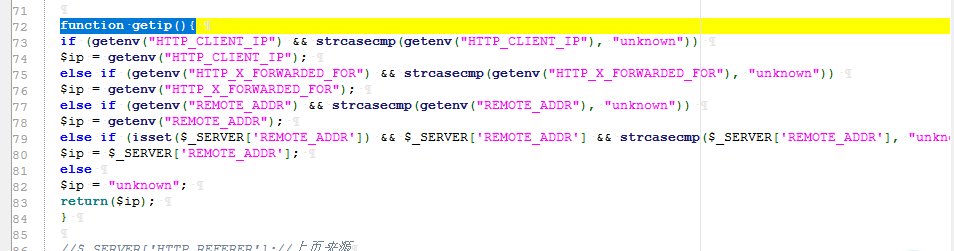

这里使用了getenv()

和$_SERVER()去获取参数

哦豁，nice，根据其sql语句，定位数据库和表格

准确来说不是这个语句，但是是这个php

"select * from zzcms_login_times where ip='$ip' and count>='".trytimes."' and unix_timestamp()-unix_timestamp(sendtime)<".jgsj." ";

 ip='$ip' 

这里

确定了

select

然后就是看数据库表格zzcms_login_times

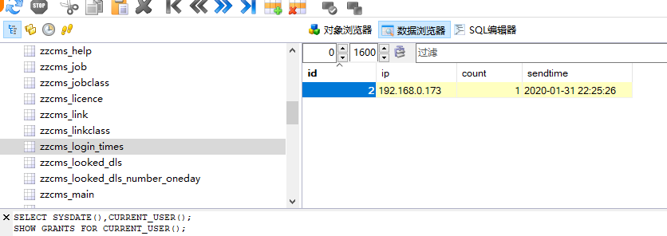

然后去寻找这个功能点，是什么时候记录的

而根据getip函数去调用，

我可以构造一个假的heard

X-Forwarded-For

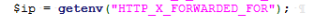

**这里要经过一系列的功能点点击**

**还有很多流程根据php的文件流程走一遍确认的**

这里我定位了登陆这里有这个漏洞

但是必须是一次登陆正确一次登陆错误才会触发数据库记录

可以看到

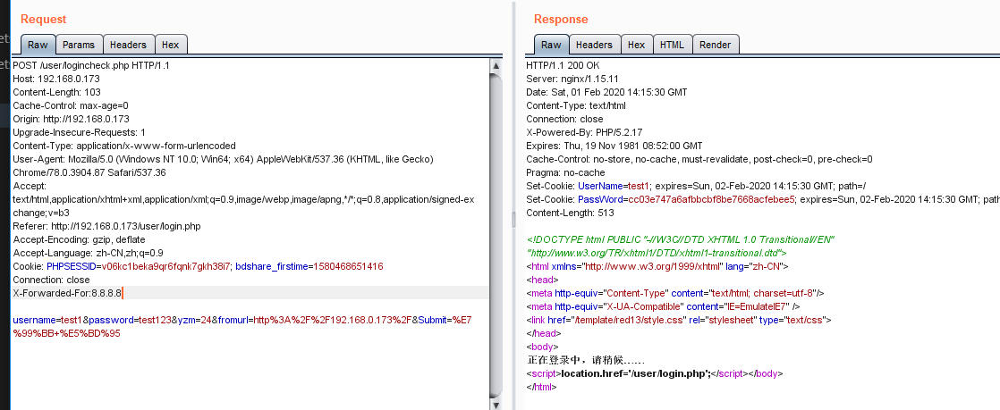

正确后错误一次可以记录了：

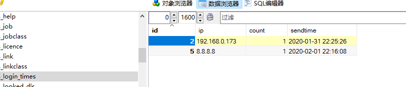

然后就是利用

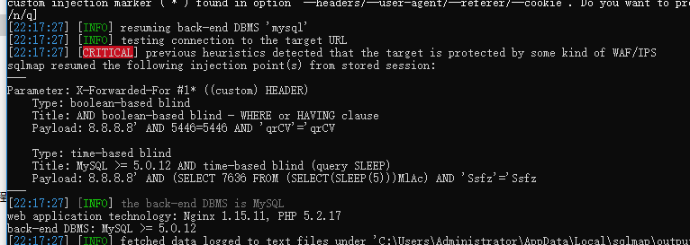

成功跑出数据了：

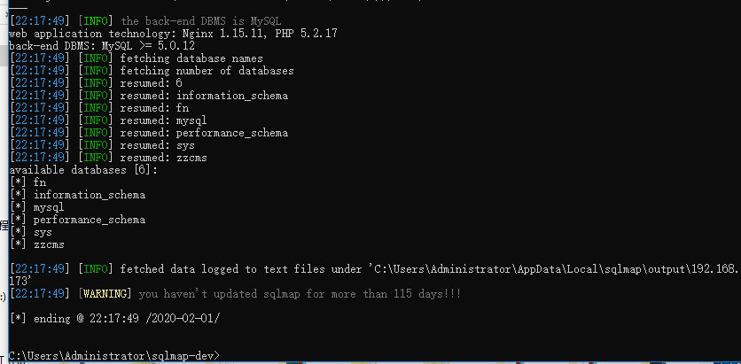