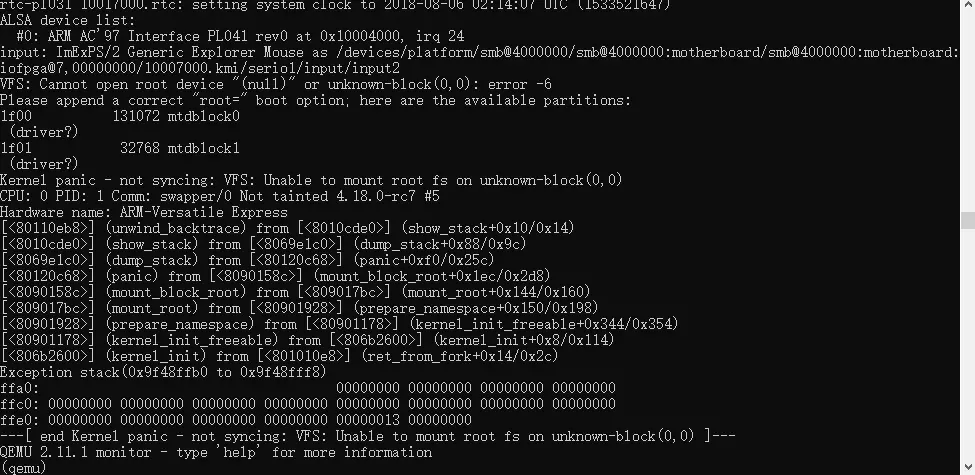

## qemu-system-arm仿真


```
相关文章：
https://www.jianshu.com/p/91baa4d140a2
https://jimp.top/IOT-Vulnerabilities/
```

#### 1、安装

```
sudo apt install qemu-system-arm
sudo apt install qemu-arm

```

#### 2、资源站点

```
https://people.debian.org/~aurel32/qemu/armhf/
	vmlinuz-3.2.0-4-vexpress 
	initrd.img-3.2.0-4-vexpress
	debian_wheezy_armhf_standard.qcow2
	debian_wheezy_armhf_desktop.qcow2

```

#### 3、问题处理

从“踩坑记”博文中可以看到，如下图该图片，而利用parrot系统的问题，就是连（qume）也不会进去，所以博文中写出的照片是存在错误的理解，可能是windows系统下的特殊性，因此，parrot系统根据该文提到的“踩坑”并未相符。此外，u-boot并未提到相关的作用以及其意义是什么，只是仿真的启动。




在资源站点中，debian_wheezy_armhf_standard.qcow2里的大小是25G，这里直接在执行的时候会返回大小不符合倍数的要求，而无法启动，因此，需要通过qemu-img去修改才能修改到相关的

```
qemu-img resize debian_wheezy_armhf_standard.qcow2 32G

sudo qemu-system-arm -M vexpress-a9 -kernel vmlinuz-3.2.0-4-vexpress -initrd initrd.img-3.2.0-4-vexpress -drive if=sd,file=debian_wheezy_armhf_standard.qcow2 -append "root=/dev/mmcblk0p2 console=ttyAMA0" -net nic -net tap,ifname=tap0,script=no,downscript=no -nographic
```


数据挂载，数据挂载对于直接下载vexpress-a9简直就是痛点，因此，这里直接通过在arm虚拟机中启动了eth0指向10.10.10.2

因此直接通过ssh去传输相关文件，即scp命令，实现过程如下：

```
可以先在宿主机中新建一个虚拟网卡
sudo tunctl -t tap0
sudo ifconfig tap0 10.10.10.1/24 up
然后在arm虚拟机中执行配置网卡
ifconfig eth0 10.10.10.2/24 up

然后主机中传输文件：
sudo scp -r test_main_MASTER  root@10.10.10.2:/root/
```


#### 4、调试

```
sudo qemu-system-arm -M vexpress-a9 -kernel vmlinuz-3.2.0-4-vexpress -initrd initrd.img-3.2.0-4-vexpress -drive if=sd,file=debian_wheezy_armhf_standard.qcow2 -append "root=/dev/mmcblk0p2 console=ttyAMA0" -net nic -net tap,ifname=tap0,script=no,downscript=no -nographic
```


##### 4.1 Linux内核级调试

如果需要调试Linux内核级别的话，则需要直接在源码上加上调试端口以及-S命令，这样就可以直接在内核端进行调试

```
sudo qemu-system-arm -M vexpress-a9 -S -gdb tcp::9000 -kernel vmlinuz-3.2.0-4-vexpress -initrd initrd.img-3.2.0-4-vexpress -drive if=sd,file=debian_wheezy_armhf_standard.qcow2 -append "root=/dev/mmcblk0p2 console=ttyAMA0" -net nic -net tap,ifname=tap0,script=no,downscript=no -nographic
```

然后再到gdb中进行远程连接：

```
（gdb）target remote:9000
```


##### 4.2 qemu虚拟机中应用调试

打开gdbserver

https://github.com/marcinguy/arm-gdb-static

直接通过scp传入到虚拟机中即可运行。

```
root@debian-armhf:~# ./gdbserver 10.10.10.2:1234 test_main_MASTER
```

但是注意，前提是必须开启着网络端口，若未启动网络端口，则必须通过如下命令进行网络端口启动

```
root@debian-armhf:~# ifconfig eth0 10.10.10.2/24 up
```

然后gdb中进行远程连接

**注：arm系统中没有run，必须通过continue / c进行执行**

```
（gdb）target remote 10.10.10.2:1234
（gdb）b main
（gdb）c
```

